# Introduction

Nous allons coder notre jeu avec PhaserJS la version 2 (CE)

Prenons le template de base d’un jeu de baston que l’on va enrichir, que vous trouverez sur mon compte GitHub

Je vais pas vous parler d’une méthode de productivité prenez bien votre temps pour comprendre le fonctionnement de Phaser 2 (CE)

Nous allons donc construire notre jeu au fur et à mesure

# Trouver les sprites

Pour commencer on doit trouver les sprites pour notre jeu, pour cela rendez vous sur le site sprite ressources et cherchez street fighter 2 sur snes

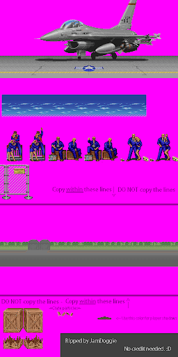

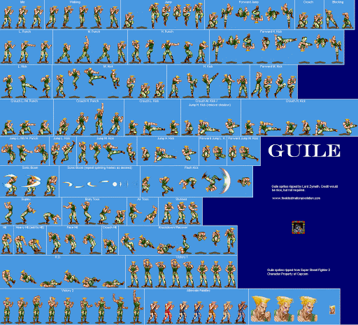

# Commençons par afficher le fond d’écran

Si vous avez bien suivi mon Cookbook sur Phaser vous aurez compris qu’il suffit de charger une image et l’afficher, mais comme nous avons une série d’images pour construire l’environnement du combat nous allons détailler cela

Alors j’ai choisis l’aéroport avec l’avion de guerre où Guile a l’habitude de se battre, donc sur sprite ressource nous avons cette image que l’on va décomposer

J’utilise The Gimp car c’est un logiciel libre qui permet déjà de faire beaucoup de choses

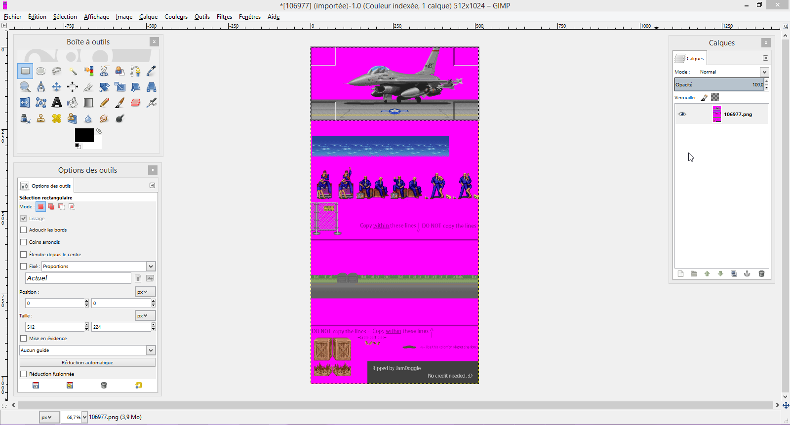

Comme on le voit sur la photo il suffit d’ouvrir l’image puis de découper l’image principale et faire cela avec chaque élément de l’environnement de combat

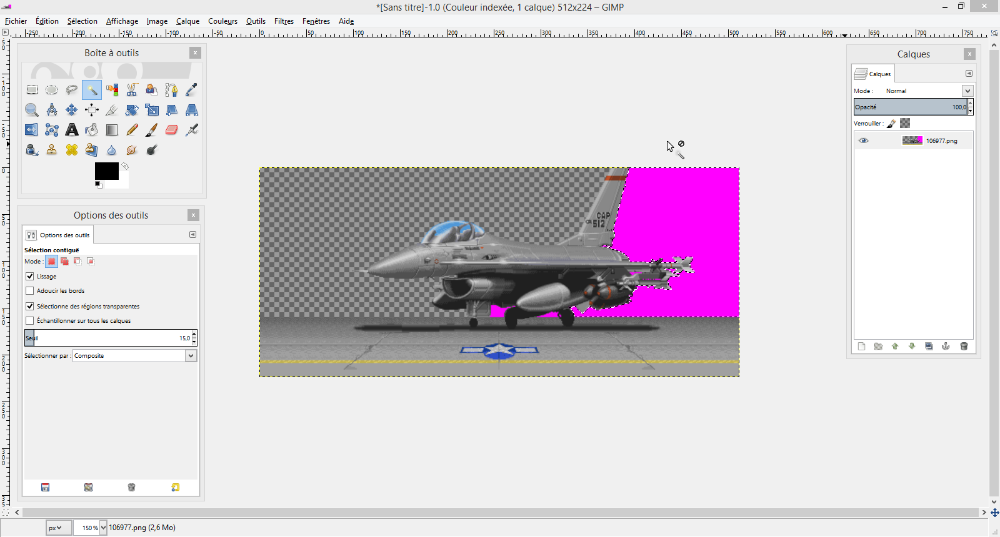

Ensuite il suffit de supprimer le fond rose, donc ajouter la transparence via le menu calque puis outil de sélection car les images n’ont pas de transparence

Au delà du fait de charger l’image via la méthode preload() il suffit donc je l’ajouter dans la méthode create() de cette manière

var game = new Phaser.Game(800, 600, Phaser.AUTO, 'game', { preload: preload, create: create, update: update });

function preload() {

  game.load.image('bkg', 'assets/background.png');

}

function create(){

  game.add.image(0, 0, 'bkg');

}

function update(){

}

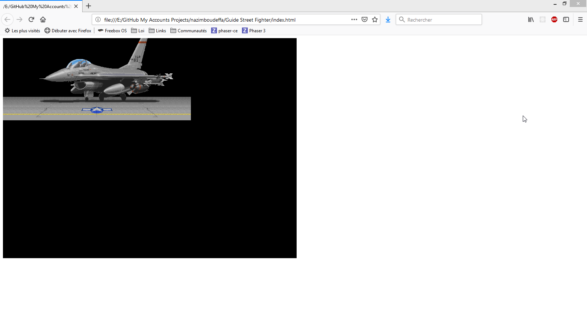

Avec un peu de magie on arrive à ce résultat

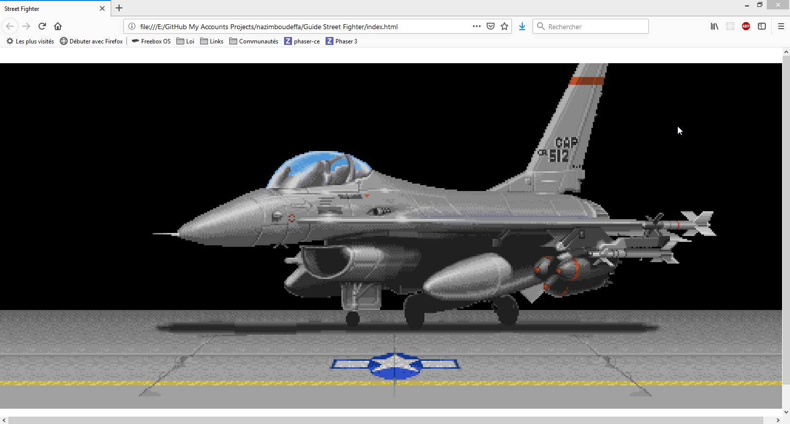

Pour cela on doit faire un peu de CSS et ajouter la fonction init() comme suit

var game = new Phaser.Game(512, 224, Phaser.AUTO, 'game', { init: init, preload: preload, create: create, update: update });

function init(){

  Phaser.Canvas.setImageRenderingCrisp(game.canvas);
  game.renderer.renderSession.roundPixels = true;
  game.scale.scaleMode = Phaser.ScaleManager.SHOW_ALL;
  game.scale.pageAlignHorizontally = true;
  game.scale.pageAlignVertically = true;

}

Je vais pas rentrer trop dans les détail de la scène car nous allons passer à l’affichage du joueur

# Afficher le personnage

J’ai choisi Guile car c’est le personnage qui m’a toujours plus quand j’étais jeune, après j’ai appris à jouer avec les autres personnages et découvrir leur histoire comme Ryu que j’ai pu découvrir très longtemps après en 2005 juste avant la sortie sur PC de Street Fighter V mais il n’empêche que Guile est très simple à jouer

Comme pour L’image de fond nous allons découper chaque sprite et lui affecter un nom spécifique pour pouvoir l’utiliser après avec Texture Packer

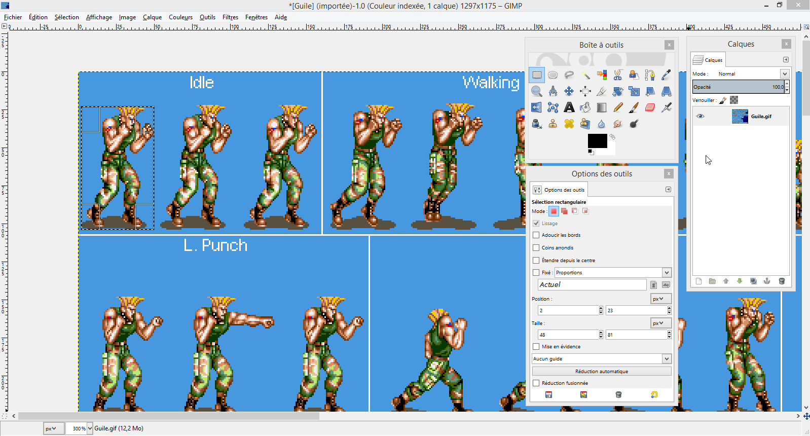

Nous obtenons pour l’animation IDLE c’est trois sprites

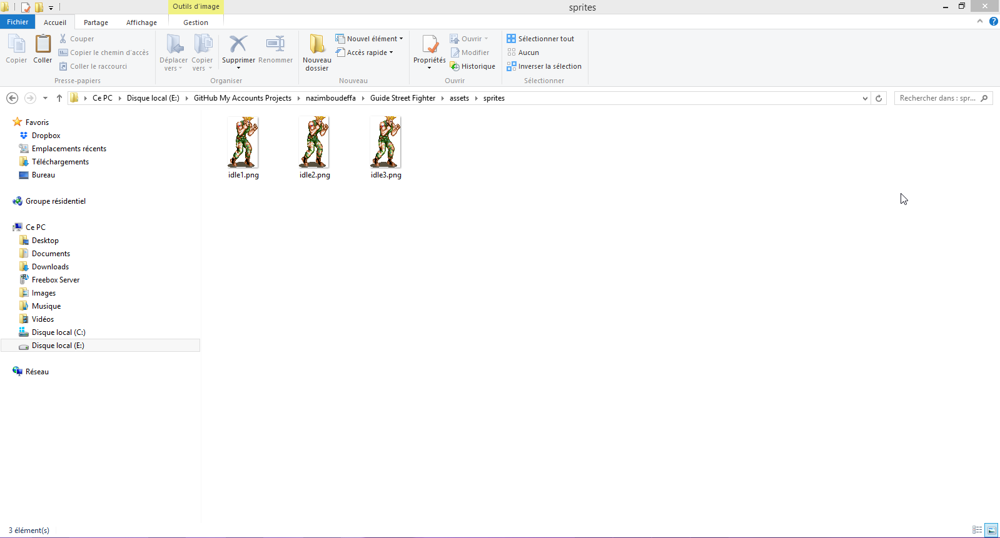

On fait de même pour les autres animations, donc walking vous aurez 5 sprites, walking1, …, walking5

Créer le spritesheet avec Texture Packer

Pour gérer les animations nous allons utiliser Texture Packer, donc il suffit d’ajouter les sprites et générer la spritesheet et le fichier json ce qu’lon appel un Atlas Json Array

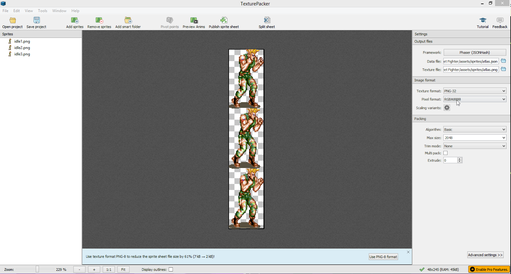

Maintenant on va ajouter le sprite et le centrer comme il faut avec le sol qu’on aura aussi découpé dans la fond d’écran
 Dans la méthode create()

  game.physics.startSystem(Phaser.Physics.ARCADE);

  ground = game.add.sprite(0, 198, 'ground');
  game.physics.arcade.enable(ground);
  ground.body.enable = true;
  ground.body.immovable = true;

  player = game.add.sprite(50, 50, 'guile', 'idle1.png');
  game.physics.arcade.enable(player);
  player.body.gravity.y = 300;

  player.body.collideWorldBounds = true;

IMPORTAN ! Ici surtout vous ajoutez le sol sous forme de sprite et pas d’image sinon y aura pas de collision

Animer le personnage

Dans create() on ajoute ls animations
player.animations.add('idle', ['idle1.png','idle2.png','idle3.png']);

Puis dans update() on les joue
player.animations.play('idle', 6, true);

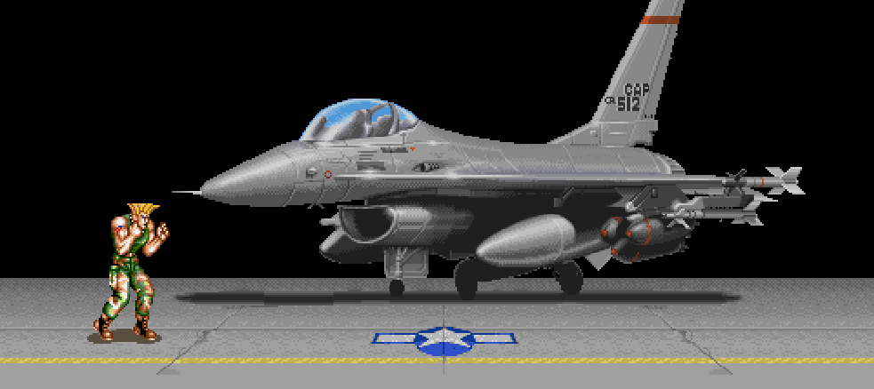

Bouger le personnage

Dans la méthode update() en ayant bien définit l’animation walking avant il suffit d’ajouter ces lignes de code

  if (cursors.right.isDown)
  {
	player.body.velocity.x = 80;
	player.animations.play('walking', 6, true);
  }
  else if(cursors.left.isDown)
  {
	player.body.velocity.x = -80;
	player.animations.play('walking', 6, true);
  }
  else
  {
	player.body.velocity.x = 0;
	player.animations.play('idle', 6, true);
  }

IMPORTANT!
Les animations ne seront peut être pas aligné, donc pour les aligner il faut créer des sprites dont l’ombre est fixée en bas de l’image

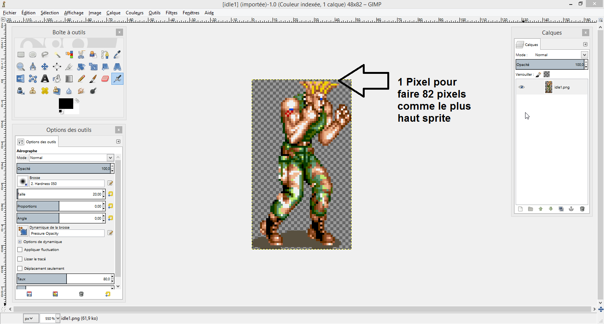

IMPORTANT!
Si vous avez des problèmes dans votre code utilisez la version non minimale de phaser ce et cherchez là où y a une erreur
