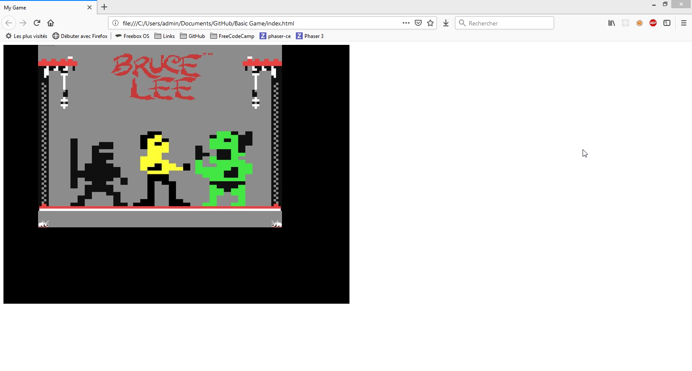

# Niveau 1 : Script Kiddie

Ce chapitre explique les fonctionnalités de base de Phaser CE, comment ajouter un sprite, une image, du texte et des sons, puis comment déplacer un sprite et de nombreux autres problèmes

## Comment créer votre premier jeu

### Problème

Vous voulez créer une page html et afficher une image avec laquelle jouer

### Solution

Une page HTML de base avec Phaser CE est une page `index.html` où vous ajoutez une balise de script avec la source pointant vers `phaser.min.js`




## Comment ajouter une image

### Problème

Vous voulez ajouter une image en tant qu'image de fond

### Solution

Votre jeu a peut être besoin d'avoir une image de fond, alors vous aurez besoin de faire ceci

```
var game = new Phaser.Game(640, 360);
var myGame = function () {};
myGame.prototype = {
  preload: function () {
    game.load.image('menu', 'assets/bruce-lee.png');
  },
  create: function () {
    game.add.image(0, 0, 'menu');
  }
}
```

### Discussion

Pour ajouter une couleur de fond il suffit d'ajouter cette ligne de code à la méthode create()

```
game.stage.backgroundColor = "#424242";
```

## Comment ajouter un sprite

### Problème

Ajouter un sprite

### Solution

Afin d'avoir un objet avec lequel jouer

```
var game = new Phaser.Game(640, 360);
var myGame = function () {};
myGame.prototype = {
  preload: function () {
    game.load.image('mario', 'assets/mario.png');
  },
  create: function () {
    game.add.sprite(0, 0, 'mario');
  }
}
```

### Discussion

La diffèrence entre un sprite et une image sera vu plus loin quand vous commencerez à jouer avec votre sprite en lui ajoutant un corps

## Comment ajouter une spritesheet

### Problème

Ajouter une spritesheet

### Solution

C'est la même chose qu'ajouter un sprite, mais vous avez besoin de charger votre spritesheet diffèrement qu'une image ou un sprite

```
var game = new Phaser.Game(640, 360);
var myGame = function () {};
myGame.prototype = {
  preload: function () {
    game.load.spritesheet('zelda','assets/tunic.png', 24, 32, 24);
  },
  create: function () {
    game.add.sprite(0, 0, 'zelda');
  }
}
```

### Discussion

Après avoir ajouté un sprite vous aurez juste besoin de l'animer (voir animer simplement un sprite)

## Quelle est la meilleur taille pour votre jeu

### Problème

Vous voulez créer un jeu et vous ne savez pas comment commencer

### Solution

Vous pouvez comprendre qu'il existe trois tailles de jeux: Petit, Moyen et Grand.

#### Petit jeu

Il est bon d’utiliser la fonctionnalité prototype de javascript pour définir un petit jeu. Plus tard dans ce livre
nous verrons comment créer un `state`

```
var game = new Phaser.Game(640, 480);
var myGame = function () {};
myGame.prototype = {
  preload: function () {
    this.load.image('logo', 'assets/phaser2.png');
  },
  create: function () {
    this.logo = this.add.image(0, 0, 'logo');
  },
  update: function () {
  }
}
```

#### Moyen jeu

Le fichier `game.js` ressemblera à ceci

```
bootState = {
  init: function() {
    game.scale.scaleMode = Phaser.ScaleManager.SHOW_ALL;
    game.scale.pageAlignHorizontally = true;
    game.scale.pageAlignVertically = true;
  },
  preload: function() {
    game.load.image('progressBar', 'assets/sprites/preloader.png'),
    game.load.image('progressBarBg', 'assets/sprites/preloaderbg.png'),
    game.load.image('loader', 'assets/sprites/loader.png')
  },
  create: function() {
    game.state.start('load')
  }
},
loadState = {
    preload: function() {
      var a = game.add.image(game.world.centerX, game.world.centerY, 'loader');
      a.anchor.setTo(.5, .5);
      var b = game.add.sprite(game.world.centerX, game.world.centerY + 50, 'progressBarBg');
      b.anchor.setTo(.5, .5);
      var c = game.add.sprite(game.world.centerX, game.world.centerY + 50, 'progressBar');
      c.anchor.setTo(.5, .5),
      game.load.setPreloadSprite(c),

      game.load.image('logo', 'assets/sprites/phaser2.png');

    },
    create: function() {
      game.state.start('play')
    }
  },
playState = {
  create: function(){

  },
  update: function(){

  }
};

game = new Phaser.Game(320, 640);

game.state.add('boot', bootState);
game.state.add('load', loadState);
game.state.add('play', playState);

game.state.start('boot');
```

#### Grand jeu

Ici, je ne veux tout simplement pas mentir. Je n’ai pas encore travaillé sur une telle chose, mais j’ai donné un coup de pied oblique dans le code de Five Nations, un jeu dont j’ai une copie sur mon github avant qu’il ne devienne privé, juste Pensez aux types de jeux "quelque chose.io".


