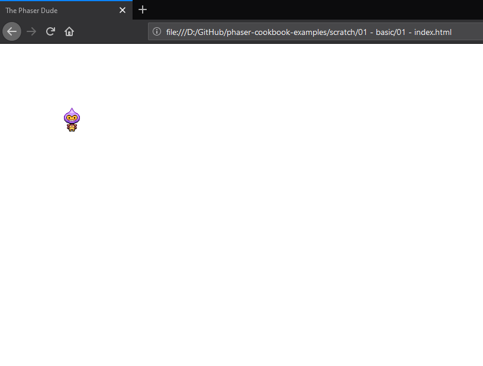
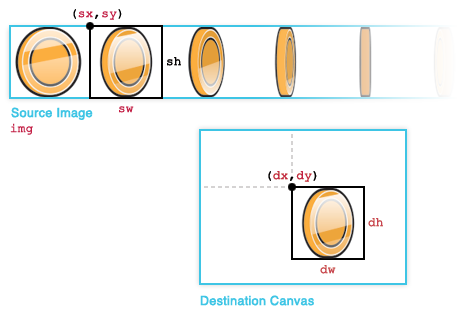

# Chapitre 1 : Comment afficher une image en javascript

Phaser est basé sur PIXI alors essayons d'afficher une image simpele

Dans votre fichier HTML vous allez juste écrire

```javascript
<canvas id = "canvas"></canvas>
<script>
  //code
</script>
```

Dans la partie javascript que vous allez inclure ce bout code

```javascript
(function(){

  var canvas = document.getElementById('canvas');
  canvas.width = 400;
  canvas.height = 300;
  var context = canvas.getContext('2d');

  var image = new Image();
  image.src = 'https://raw.githubusercontent.com/nazimboudeffa/assets/master/sprites/phaser-dude.png';

  //we use an event listener to be sure that the image has been loaded
  image.addEventListener('load', function() {
    context.drawImage(image, 100, 100);
  }, false);

})();
```

On obtient ceci




Ce qu'il faut comprendre c'est que ça permet d'afficher une image avec la fonction

```javascript
drawImage(image, sx, sy, sWidth, sHeight, dx, dy, dWidth, dHeight)
```


Observons un peu cette fonction

image   Source image object	Sprite sheet

sx	    Source x	Frame index times frame width

sy	    Source y	0

sWidth	Source width	Frame width

sHeight	Source height	Frame height

dx	    Destination x	0

dy	    Destination y	0

dWidth	Destination width	Frame width

dHeight	Destination height	Frame height



Maintenant imaginons que l'on souhaite animer cette image, alors on aura besoin d'afficher plusieures images diffèrentes espacées par un lapse de temps

```javascript

(function () {

	var coin,
		coinImage,
		canvas;					

	function gameLoop () {

	  window.requestAnimationFrame(gameLoop);

	  coin.update();
	  coin.render();
	}

	function sprite (options) {

		var that = {},
			frameIndex = 0,
			tickCount = 0,
			ticksPerFrame = options.ticksPerFrame || 0,
			numberOfFrames = options.numberOfFrames || 1;

		that.context = options.context;
		that.width = options.width;
		that.height = options.height;
		that.image = options.image;

		that.update = function () {

            tickCount += 1;

            if (tickCount > ticksPerFrame) {

				tickCount = 0;

                // If the current frame index is in range
                if (frameIndex < numberOfFrames - 1) {
                    // Go to the next frame
                    frameIndex += 1;
                } else {
                    frameIndex = 0;
                }
            }
        };

		that.render = function () {

		  // Clear the canvas
		  that.context.clearRect(0, 0, that.width, that.height);

		  // Draw the animation
		  that.context.drawImage(
		    that.image,
		    frameIndex * that.width / numberOfFrames,
		    0,
		    that.width / numberOfFrames,
		    that.height,
		    0,
		    0,
		    that.width / numberOfFrames,
		    that.height);
		};

		return that;
	}

	// Get canvas
	canvas = document.getElementById("coinAnimation");
	canvas.width = 100;
	canvas.height = 100;

	// Create sprite sheet
	coinImage = new Image();

	// Create sprite
	coin = sprite({
		context: canvas.getContext("2d"),
		width: 1000,
		height: 100,
		image: coinImage,
		numberOfFrames: 10,
		ticksPerFrame: 4
	});

	// Load sprite sheet
	coinImage.addEventListener("load", gameLoop);
	coinImage.src = "images/coin-sprite-animation.png";

} ());

```
